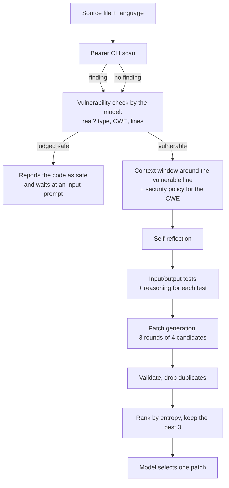

# Creation of a Private Security Vulnerability Repair System Using Local Language Models

*Δημιουργία Ιδιωτικού Συστήματος Επιδιόρθωσης Ευπαθειών Ασφαλείας με τη Χρήση Τοπικών Γλωσσικών Μοντέλων*

Diploma thesis by **Christos Kounsolas** — Department of Electrical and Computer Engineering, Aristotle University of Thessaloniki, December 2025.
Supervised by Prof. Andreas Symeonidis, with PhD candidates Giorgos Siachamis and Dimosthenis Natsos.

| | |
|---|---|
| Thesis (PDF, in Greek) | [docs/thesis_Kounsolas.pdf](docs/thesis_Kounsolas.pdf) |
| Full pipeline | [notebooks/vulnerability_repair_pipeline.ipynb](notebooks/vulnerability_repair_pipeline.ipynb) [](https://colab.research.google.com/github/kounsolas/thesis/blob/main/notebooks/vulnerability_repair_pipeline.ipynb) |
| Single-shot baseline | [notebooks/vulnerability_repair_baseline.ipynb](notebooks/vulnerability_repair_baseline.ipynb) [](https://colab.research.google.com/github/kounsolas/thesis/blob/main/notebooks/vulnerability_repair_baseline.ipynb) |
| Vulnerable demo apps | [vulnerable-apps/](vulnerable-apps/) |

> [!WARNING]
> The applications under `vulnerable-apps/` are vulnerable on purpose: some of them execute arbitrary commands or code sent by the browser. Run them only on your own machine. They listen on `127.0.0.1` only and must never be deployed.

## What this is

The thesis builds a system that finds and repairs security vulnerabilities in source code with a language model that it loads and runs itself instead of calling a cloud API, so the code under analysis does not have to be sent to a model provider. The experiments ran on a Google Colab GPU runtime, and the notebooks here are written for Colab; the code stays on your own machine only if you run the pipeline on hardware you control.

A static analyser (Bearer) reports a finding. A local model (NextCoder-32B, 4-bit AWQ) then repairs it in several small steps instead of one: it confirms the finding, explains the problem in its own words, writes input/output tests, generates several candidate patches, and selects one after the candidates have been ranked.

## Abstract

> In today's era, Large Language Models (LLMs) such as ChatGPT have significantly transformed the software development process by providing a very fast and efficient way to write code. One of the research directions that is still in its early stages is the use of LLMs to address security issues.
>
> However, the fact that most models are available in the Cloud, partly due to their enormous computational requirements, automatically raises questions of confidentiality and privacy. For this reason, there has been growing research interest in models that can run locally, which provide similar capabilities to Cloud-based models but without requiring sensitive data to be sent to external servers.
>
> Following this trend, the aim of this thesis is to create a system that performs security checks (Static Application Security Testing) on web applications and feeds the results into a locally installed LLM in order to fix the identified issues.
>
> Due to the limited resources of local LLMs, the generation of appropriate code fixes will not be performed in a single stage but will be done through a multi-step process. Initially, the model will attempt to understand the problem, then it will generate input-output tests to guide the model in producing the final fix, and finally, it will select the best fix after generating and evaluating multiple possible solutions.
>
> The results of the thesis show that the developed methodology presents quite promising results, as in vulnerable codes that were examined, the system managed to identify their vulnerabilities and in a large percentage of cases, to produce fixes that were functional and secure. The above is a first step for the evaluation of the developed methodology, as well as for understanding the capabilities of local LLMs in addressing security issues in code.

The thesis text is in Greek; the abstract above is its English abstract.

## Pipeline



| Stage | What the notebook does | Decoding |
|---|---|---|
| Static analysis | Bearer CLI 1.49.0 scans the file (`--scanner sast`). The first finding is processed. If Bearer reports nothing, the file goes to the next stage without a report. | — |
| Vulnerability check | The model decides whether the code is really vulnerable and returns the vulnerability type, CWE and line numbers. Where it disagrees with Bearer, its answer is used. | greedy |
| Context | A window of 20 lines either side of the vulnerable line is cut out, and the security policy for the CWE is selected. Policies list allowed and disallowed fixes for CWE-22, 73, 78, 79, 89, 95, 352, 601 and 918, with a default for everything else. | — |
| Self-reflection | The model describes the vulnerability, how it arises and what a robust fix must consider. It is told not to write a fix yet. | temperature 0.8, top-p 0.95 |
| Test generation | The model writes up to five input/output tests that describe the behaviour after the fix, then adds a short reasoning to each test. | temperature 0.8, top-p 0.95; reasoning greedy |
| Patch generation | Three rounds of four candidates. Each candidate is a YAML object with the line range to replace and the replacement code. Candidates that do not parse, fail the schema check or repeat an earlier one are dropped. | temperature 0.9, top-p 0.95 |
| Ranking | Candidates that cover a vulnerable line and stay inside the window are sorted by entropy (the negative log-probability of the generated tokens), lowest first. The best three are kept. If no candidate passes both checks, all valid candidates are ranked. | — |
| Selection | The model receives the three candidates with the policy, the tests and its own reflection, and chooses one. | temperature 0.9, top-p 0.95 |

The generated tests are not executed. They are passed to the model as guidance in the patch-generation and selection prompts, and the validation step checks only the form of a candidate.

The result is a proposed patch: a line range and the code that should replace it. The notebook does not apply the patch to the file.

The baseline notebook keeps the scan, the vulnerability-check prompt, the context window and the policies, then asks the model for a patch once. Its vulnerability check is sampled at temperature 0.9 instead of decoded greedily.

## Results

The measure throughout is the number of tries needed until the pipeline produced a correct patch.

### Experiment 1 — AI-generated vulnerable websites

Eleven small JavaScript websites, each built around a single vulnerability, were generated with ChatGPT for this experiment. They are the apps in [vulnerable-apps/](vulnerable-apps/) under `SQLi`, `XSS`, `PathTraversal` and `SSRF`. All eleven were repaired (thesis, Table 4.1).

| Example | Tries | Note |
|---|---|---|
| [SQL Injection – Example 1](vulnerable-apps/SQLi/1_code_example/) | 1 | |
| [SQL Injection – Example 2](vulnerable-apps/SQLi/2_code_example/) | 1 | |
| [SQL Injection – Example 3](vulnerable-apps/SQLi/3_code_example/) | 1 | Small miss in the `replace_lines` field |
| [XSS – Example 1](vulnerable-apps/XSS/1_code_example/) | 1 | |
| [XSS – Example 2](vulnerable-apps/XSS/2_code_example/) | 1 | |
| [Path Traversal – Example 1](vulnerable-apps/PathTraversal/1_code_example/) | 2 | |
| [Path Traversal – Example 2](vulnerable-apps/PathTraversal/2_code_example/) | 1 | |
| [Path Traversal – Example 3](vulnerable-apps/PathTraversal/3_code_example/) | 1 | |
| [SSRF – Example 1](vulnerable-apps/SSRF/1_code_example/) | 1 | |
| [SSRF – Example 2](vulnerable-apps/SSRF/2_code_example/) | 1 | |
| [SSRF – Example 3](vulnerable-apps/SSRF/3_code_example/) | 2 | |

### Experiment 2 — YesWeHack vulnerable code snippets

Twenty-three files in PHP, JavaScript, Java and Python from the [YesWeHack vulnerable code snippets](https://github.com/yeswehack/vulnerable-code-snippets) repository, which are longer and more complex than the generated websites. The files are not part of this repository, with one exception: Vsnippet #19 (`open-redirect-url-fragment`) is the example input saved in both notebooks.

| | Repaired | Success rate |
|---|---|---|
| Full pipeline | 15 of 23 | 65.22 % |
| Single-shot baseline | 12 of 23 | 52.17 % |

Of the 15 files the pipeline repaired, 9 needed one try, 3 needed two, 2 needed three and 1 needed five.

| Vulnerability type | Files | Repaired | Success rate | Average tries when repaired |
|---|---|---|---|---|
| Cross-site scripting | 7 | 3 | 43 % | 2 |
| SQL injection | 5 | 4 | 80 % | 1 |
| Server-side request forgery | 2 | 1 | 50 % | 5 |
| Path traversal | 2 | 2 | 100 % | 1.5 |
| Command injection | 3 | 1 | 33 % | 1 |
| Code injection | 1 | 1 | 100 % | 3 |
| Open redirect | 3 | 3 | 100 % | 1.3 |

The thesis notes that the per-type rates are indicative only, because each type has few files.

<details>
<summary>Per-file results (thesis, Tables 4.2 and 5.1)</summary>

Tries until a correct patch; ✗ means no correct patch was produced.

| File | Pipeline | Baseline | Note on the pipeline run |
|---|---|---|---|
| xss-christmas | 1 | 1 | |
| xss-classic | 3 | ✗ | Very close to the correct fix from the first try |
| xss-csp-bypass | ✗ | ✗ | The correct vulnerable line was not located |
| xss-dom-postmessage | ✗ | ✗ | The vulnerability was not detected |
| xss-ethical-hackers | ✗ | 1 | Not a common-case XSS |
| xss-script-tag | ✗ | ✗ | |
| xss-string-outbreak | 2 | ✗ | |
| sqli-blind-variable | 1 | 1 | |
| sqli-columns | ✗ | ✗ | |
| sqli-escape-invalid | 1 | 1 | |
| sqli-login | 1 | 1 | |
| sqli-second-order | 1 | 1 | |
| ssrf-regex-bypass | 5 | ✗ | Difficulty matching the vulnerability to SSRF |
| ssrf-XFH-header | ✗ | ✗ | |
| pathTraversal-improper-regex | 2 | 3 | |
| pathTraversal-replace-limit | 1 | 1 | |
| command-injection-classic | ✗ | 2 | Safe but non-functional patches |
| command-injection-escapeshellcmd | 1 | 1 | |
| command-injection-saintpatrick | ✗ | ✗ | Difficulty matching the vulnerability to command injection |
| code-injection-file-write | 3 | 2 | |
| open-redirect-classic | 2 | ✗ | |
| open-redirect-invalid-regex | 1 | 2 | |
| open-redirect-url-fragment | 1 | ✗ | |

</details>

### Limitations stated in the thesis

- A model small enough to run locally is noticeably weaker than cloud models. Without the intermediate stages and carefully structured prompts it drifted from the task or produced wrong patches.
- The system has not been evaluated on complete real-world applications such as OWASP Juice Shop, which limits how far the results generalise.

## Repository layout

```
README.md  CITATION.cff
docs/
  thesis_Kounsolas.pdf                      the thesis (Greek, English abstract)
notebooks/
  vulnerability_repair_pipeline.ipynb       full pipeline
  vulnerability_repair_baseline.ipynb       single-shot baseline
vulnerable-apps/                            15 intentionally vulnerable demo apps
  BrokenAccessControl/  CommandInjection/  EvalInjection/  InsecureRedirects/
  PathTraversal/        SQLi/              SSRF/           XSS/
```

Each category folder holds numbered examples (`1_code_example`, `2_code_example`, …), and each example has its own README with run and demonstration steps. [vulnerable-apps/README.md](vulnerable-apps/README.md) lists all of them.

## Running the notebooks

The notebooks are written for Google Colab (they import `google.colab` and use `/content` paths).

1. Open a notebook with its Colab badge and choose a GPU runtime with about 24 GB of GPU memory. The thesis used an NVIDIA L4 with the high-RAM option; the quantised model needs about 22 GB of GPU memory.
2. In the section *Store the vulnerable code in a file with the correct extension*, paste the code into `code` and set `language`.
3. Run all cells. Every new Colab runtime downloads Bearer and the model weights (about 22 GB).
4. Check the section *Inspect the vulnerabilities found from Bearer*: when Bearer reports several findings, the notebook processes the first one.

More detail is in [notebooks/README.md](notebooks/README.md).

## Running a demo app

Requires Node.js 20 or newer.

```bash
cd vulnerable-apps/SQLi/1_code_example
npm ci
npm start
```

Then open the address printed in the terminal. Each app's README explains how to trigger its vulnerability.

## Versions

| Component | Version |
|---|---|
| Bearer CLI | 1.49.0 |
| Model | [`stelterlab/NextCoder-32B-AWQ`](https://huggingface.co/stelterlab/NextCoder-32B-AWQ) |
| transformers / torch | 4.51.3 / 2.6.0 (with `autoawq` and `accelerate`) |
| Demo apps | Node.js 20+, Express 4, `sqlite3` 5, `node-fetch` 3 |

## Citation

```bibtex
@mastersthesis{kounsolas2025repair,
  author  = {Kounsolas, Christos},
  title   = {Creation of a Private Security Vulnerability Repair System Using Local Language Models},
  school  = {Aristotle University of Thessaloniki, Department of Electrical and Computer Engineering},
  address = {Thessaloniki, Greece},
  year    = {2025},
  month   = dec,
  type    = {Diploma thesis},
  note    = {In Greek}
}
```

GitHub's "Cite this repository" button uses [CITATION.cff](CITATION.cff).

## Copyright

© 2025 Christos Kounsolas. All rights reserved. This repository is published for reading and citation; no licence to reuse, modify or redistribute its contents is granted.

Third-party material remains the property of its owners:

- The example input saved in both notebooks is Vsnippet #19 from the YesWeHack vulnerable code snippets (`OpenRedirect/open-redirect-url-fragment`; its title line reads "Open Redirect Classic").
- The formula image in the pipeline notebook comes from C. S. Xia, Y. Wei and L. Zhang, *Automated Program Repair in the Era of Large Pre-trained Language Models*, ICSE 2023, as cited in that cell.
- Bearer CLI and the NextCoder model are downloaded at run time and are not included here.
- The thesis PDF reproduces figures from the publications it cites, the Bearer logo and the university seal; these belong to their respective owners.
